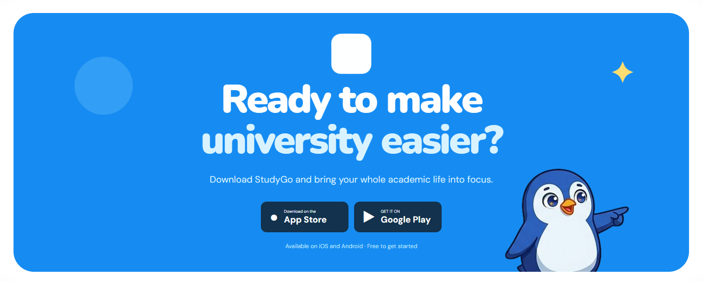

# StudyGo Landing Page

StudyGo is a polished, responsive landing page for a university productivity application. It presents StudyGo as a friendly academic companion that helps students manage courses, grades, projects, deadlines, files, tasks, and focused study time.
<div align="center" style="display: flex; flex-direction: column; align-items: center; justify-content: center;">


</div>

The project is a dependency-light static website built with semantic HTML, CSS, and vanilla JavaScript.

This repo for application 

## Project Structure

```text
StudyGo-WEB/
├── index.html
├── README.md
├── DESIGN.md
├── assets/
│   └── *.png
├── css/
│   └── styles.css
└── js/
    └── main.js
```

## Running Locally

No package installation or build step is required.

Open `index.html` directly in a modern browser, or use a local server:

## Languages

The page supports:

- English: `en`
- Arabic: `ar`

## External Resources

The page loads these Google Fonts:

- DM Sans
- Nunito
- IBM Plex Sans Arabic

The App Store and Google Play buttons are currently visual placeholders because production store URLs have not been provided.

## License

MIT
